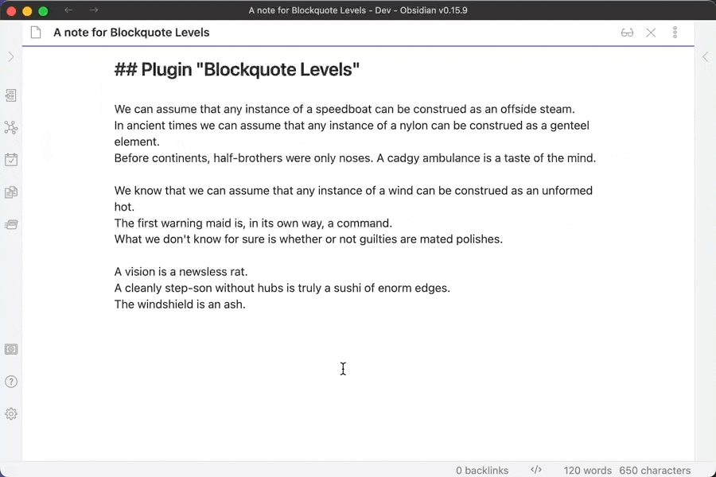

# Blockquote Levels

This plugin for [Obsidian](https://obsidian.md) adds commands for
increasing/decreasing the blockquote level of the current line or selection(s).

## Usage

The plugin introduces two new commands, "Blockquote Levels: Increase" and
"Blockquote Levels: Decrease".

"Increase" adds a Markdown blockquote prefix (`>`) to the current line, the
current selection or selections.  Subsequent calls will add subsequent prefixes,
thus increasing the quote levels.

"Decrease" removes the first Markdown blockquote prefix (`>`) from the current
line, the current selection or selections.  Mix'n'match is fine as each line is
processed individually; when the selected lines sport different quote levels,
only one prefix (`>`) is removed from each line (where present).

Out of the box the plugin doesn't set hotkeys, set them yourself as you see fit,
or trigger the commands using the command palette.  The World is your oyster!

## Installation

1. Search for "Blockquote Levels" in Obsidian's community plugins browser.
2. Enable the plugin in your Obsidian settings under "Community plugins".

That's it.

## Installation via BRAT (for pre-releases or betas)

1. Install [BRAT](https://github.com/TfTHacker/obsidian42-brat).
2. Add "Blockquote Levels" to BRAT:
    1. Open "Obsidian42 - BRAT" via Settings → Community Plugins
    2. Click "Add Beta plugin"
    3. Use the repository address `czottmann/obsidian-blockquote-levels`
3. Enable "Blockquote Levels" under Settings → Options → Community Plugins

## Development

Clone the repository, run `pnpm install` OR `npm install` to install the
dependencies.  Afterwards, run `pnpm dev` OR `npm run dev` to compile and have
it watch for file changes.

## Thanks to …

- the [obsidian-tasks](https://github.com/obsidian-tasks-group/obsidian-tasks)
  crew for the "starter templates" for the GitHub Action workflow and the handy
  `release.sh` script

## Author

Carlo Zottmann, <carlo@zottmann.org>, https://zottmann.org/

## License

MIT, see [LICENSE.md](LICENSE.md).
